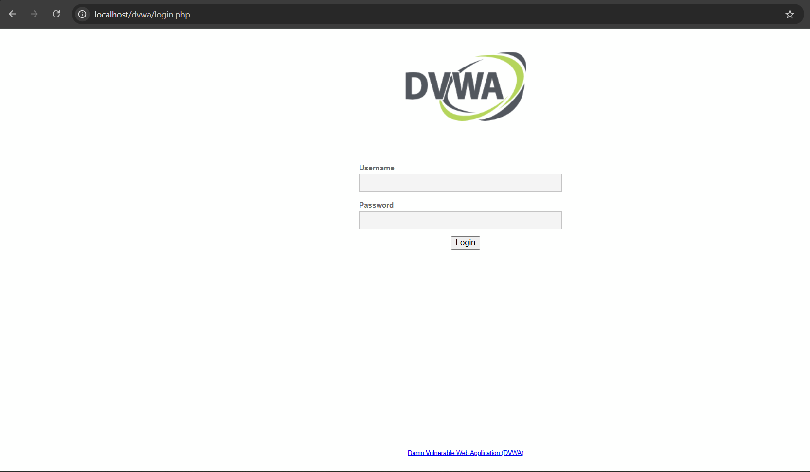
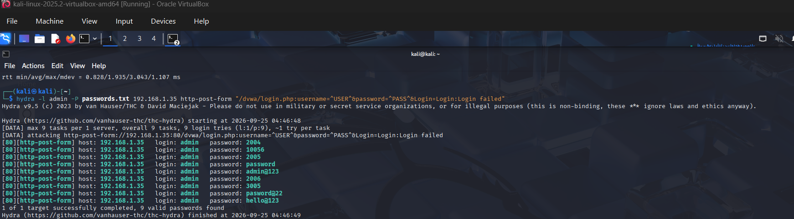
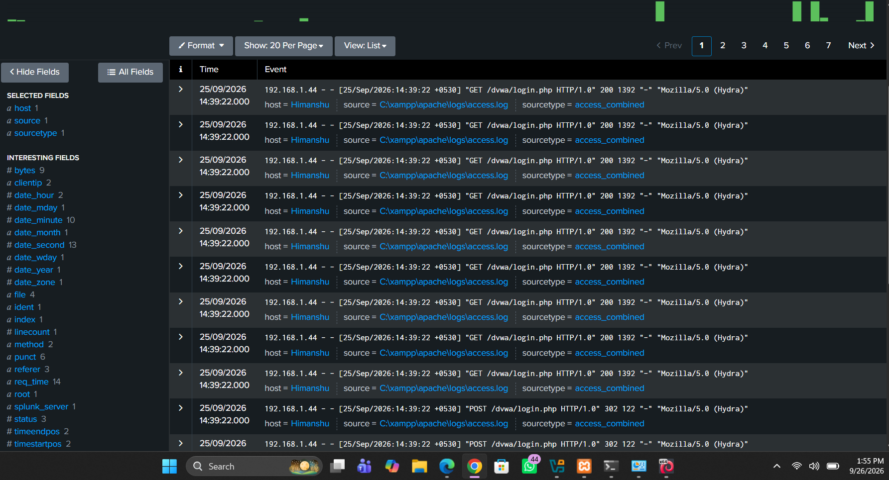

# SOC Home Lab - Brute Force Attack Simulation

## Setup
- Kali Linux (VM) - Attacker machine
- Windows + XAMPP + DVWA - Target vulnerable web application
- Splunk - SIEM for log analysis

## What I Did
1. Set up Kali Linux as an attacker machine
2. Deployed DVWA (Damn Vulnerable Web Application) using XAMPP
3. Configured network connectivity between attacker and target 
   (troubleshot firewall rules, IP addressing, bridged networking)
4. Attempted a brute-force attack on DVWA's login page using 
   Hydra with a custom wordlist
5. Installed Splunk and monitored Apache access logs to analyze 
   the attack from a defender's perspective

## Result
Hydra successfully connected and submitted login requests, but 
flagged all attempted passwords as "valid" due to a misconfigured 
failure-condition string that didn't precisely match DVWA's 
response format.

To verify the actual attack activity, I cross-referenced with 
Splunk logs — which clearly showed multiple rapid POST requests 
to /dvwa/login.php from the attacker's IP within the same second, 
with "Hydra" visible in the User-Agent field, confirming genuine 
automated brute-force activity regardless of Hydra's own 
(incorrect) output.

## What I Learned
- How automated brute-force tools like Hydra work
- Network troubleshooting (firewall, IP config, bridged networking 
  between VM and host)
- Automated tools can produce false positives — results need 
  manual verification, not blind trust
- How to identify brute-force patterns in web server logs using 
  Splunk (high-frequency requests from a single IP to a login 
  endpoint)
- The importance of cross-referencing multiple data sources when 
  investigating a security incident

## Tools Used
Kali Linux, Hydra, XAMPP, DVWA, Splunk, VirtualBox

## Screenshots

### DVWA Login Page

### Hydra Attack Output

### Splunk Logs Analysis

